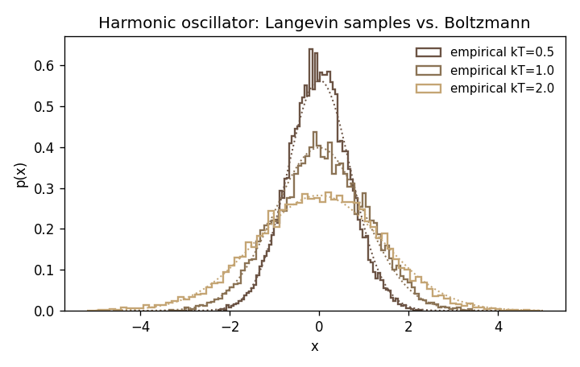

# sims/langevin

Overdamped Langevin integrator with Euler-Maruyama scheme.

## Equation

The overdamped Langevin dynamics that govern a thermodynamic substrate (see [docs/architecture/theoretical-foundations.md](../../docs/architecture/theoretical-foundations.md)):

$$\dot{x} = -\mu \,\nabla V_\theta(x) + \sqrt{2 \mu k_B T}\, \eta(t)$$

Discretized step:

$$x_{n+1} = x_n - \mu \,\nabla V(x_n)\, \Delta t + \sqrt{2 \mu k_B T\, \Delta t}\, z, \quad z \sim \mathcal{N}(0, I)$$

Natural units: $k_B = 1$. The `kT` argument carries the thermal energy scale directly.

## Files

| File | Purpose |
|---|---|
| `integrator.py` | `step()` (single Euler-Maruyama update) and `simulate()` (trajectory loop with burn-in + stride) |
| `potentials.py` | `Harmonic`, `Quadratic`, `DoubleWell`. Each exposes `energy(x)` and `grad(x)` |
| `test_integrator.py` | pytest checks: harmonic equilibrium variance, temperature scaling, quadratic mean matches `A^{-1} b` |
| `demo.py` | Generates `figures/harmonic_boltzmann.png` |

## Tests

```bash
python -m pytest sims/langevin -v
```

`test_harmonic_equilibrium_variance` runs $10^5$ steps at $\Delta t = 10^{-2}$ and checks that the empirical variance is within 5% of the analytic $k_B T / k = 1.0$.

## Figure



Empirical histograms (solid stepped lines) overlaid with the analytic Boltzmann Gaussian (dotted) for three temperatures. Agreement is the basic validation that Euler-Maruyama with the given step size sits inside the stability and accuracy regime.

## Numerical caveats

- Euler-Maruyama is weak-order 1 and strong-order 0.5. For stiff potentials or large $\Delta t$ the marginal deviates from Boltzmann. If you see a systematic bias in variance, reduce $\Delta t$ before changing anything else.
- The test thresholds (5% on variance) reflect statistical noise from finite-sample trajectories, not numerical bias. Tighter bounds need longer runs.
- The integrator assumes overdamped (first-order) dynamics. Inertial Langevin (underdamped) is not implemented and would need a separate integrator (e.g., BAOAB).
