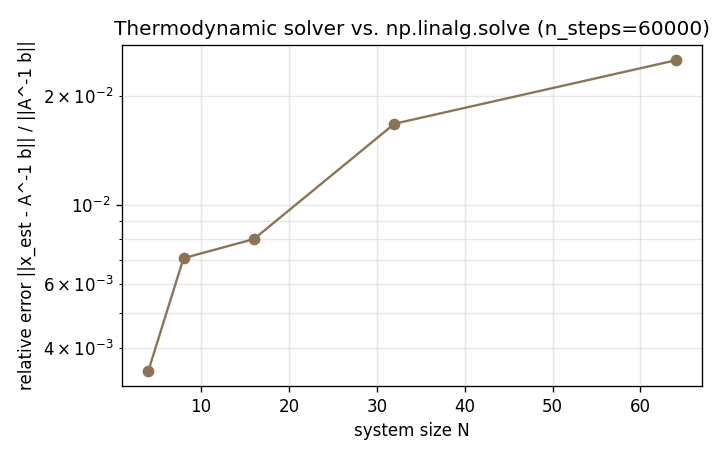

# sims/linalg

Thermodynamic linear-system solver. Solves $A x = b$ for symmetric positive-definite $A$ by Langevin relaxation.

## Mapping

The quadratic potential

$$V(x) = \frac{1}{2} x^\top A x - b^\top x$$

has a unique minimum at $x^\* = A^{-1} b$. Sampling from the Boltzmann distribution $\rho(x) \propto \exp(-V(x) / k_B T)$ gives a Gaussian centered on $x^\*$ with covariance $k_B T \cdot A^{-1}$. At low $k_B T$ the trajectory concentrates around the solution and the time average estimates $A^{-1} b$.

Formal derivation and the $O(N)$ relaxation-time scaling claim are in [docs/algorithms/thermodynamic-linear-algebra.md](../../docs/algorithms/thermodynamic-linear-algebra.md); the primary reference is Aifer et al. (2024), *Thermodynamic Linear Algebra*.

## Files

| File | Purpose |
|---|---|
| `solver.py` | `solve_thermodynamic(A, b, n_steps, kT, ...)` . builds a `Quadratic` potential, runs `sims.langevin.simulate`, averages the trajectory |
| `test_solver.py` | Correctness on random SPD matrices at $N \in \{8, 32\}$ and a diagonal sanity check |
| `benchmark.py` | Generates `figures/benchmark_error.png`: relative error vs. system size |

`solver.solve_thermodynamic` picks a default step size $\Delta t = 0.2 / (\mu \lambda_{\max}(A))$ if not supplied, which keeps the integrator stable across a range of condition numbers without being aggressively slow.

## Tests

```bash
python -m pytest sims/linalg -v
```

Tests assert relative error $< 5\%$ versus `np.linalg.solve`. Lower $kT$ tightens concentration but slows mixing across the well, so there is a tradeoff the user may tune via the `kT` argument.

## Figure



Relative error vs. system size at a fixed integration budget. Error grows with $N$ because the same trajectory length is spread over a larger-dimensional concentration volume; a hardware implementation does not have this bottleneck because it runs the dynamics in parallel across all dimensions.

## Honesty note on "speedup"

This NumPy implementation is slower than LAPACK by a large constant factor. The thermodynamic advantage referenced in the literature (Aifer et al., arXiv:2502.08603) is physical: a hardware substrate relaxes in parallel, so the $O(N^3)$ Gaussian-elimination cost collapses to $O(N)$ wall-clock relaxation on the device. This module only validates *correctness* of the mapping. Any wall-clock "speedup" benchmark against LAPACK on a CPU would be dishonest.
