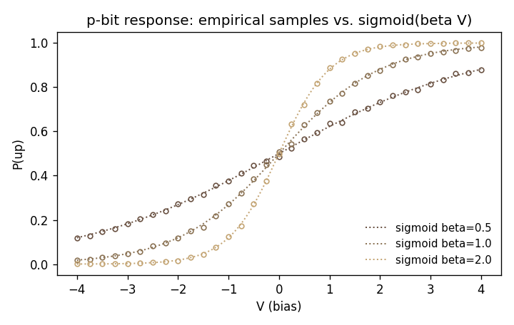

# sims/pbit

Sigmoid p-bit sampler. NumPy reference for the elementary stochastic primitive in thermodynamic hardware.

## Equation

$$P(\text{up}) = \sigma(\beta V) = \frac{1}{1 + e^{-\beta V}}$$

See [docs/architecture/hardware-primitives.md](../../docs/architecture/hardware-primitives.md) for physical realizations: low-barrier MTJ free layers, subthreshold CMOS stochastic transistors, and Josephson junctions.

## Files

| File | Purpose |
|---|---|
| `pbit.py` | `sigmoid()` (stable), `sample_pbit()` (stateless), `PBit` (stateful class) |
| `test_pbit.py` | Empirical $P(\text{up})$ within tolerance of $\sigma(\beta V)$ across a voltage sweep |
| `demo.py` | Generates `figures/sigmoid_sweep.png` |

`sample_pbit` supports both `binary` encoding (outputs in $\{0, 1\}$) and `spin` encoding (outputs in $\{-1, +1\}$), because Boltzmann machines and Ising models use different conventions.

## Tests

```bash
python -m pytest sims/pbit -v
```

The tolerance in `test_pbit_empirical_probability` is the larger of 2% and $4\sigma$ of the binomial standard error, which prevents the test from being flaky at small sample sizes or near $P=0/1$.

## Figure



Empirical $P(\text{up})$ (open circles) vs. the analytic sigmoid (dotted) for three inverse temperatures $\beta \in \{0.5, 1.0, 2.0\}$. Steeper curves correspond to lower temperature.

## Relation to hardware

The sigmoid response is an emergent property of the Boltzmann-distributed fluctuations of any two-state thermodynamic element. Any physical p-bit device that equilibrates with a bath at temperature $T$ and is biased by voltage $V$ will show this curve to first approximation; the device-specific physics is in the effective $\beta$ and any voltage-dependent corrections. This module does not model those corrections. It is the idealized sampler a hardware calibration routine must eventually match.
